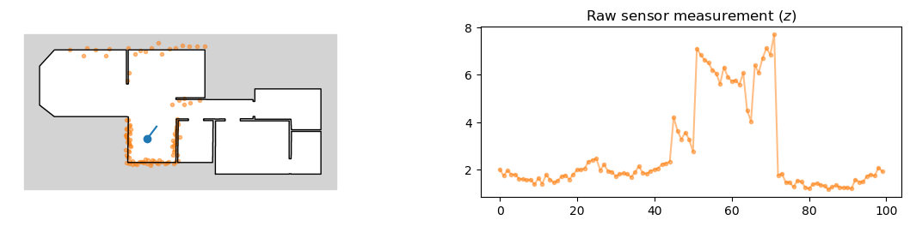
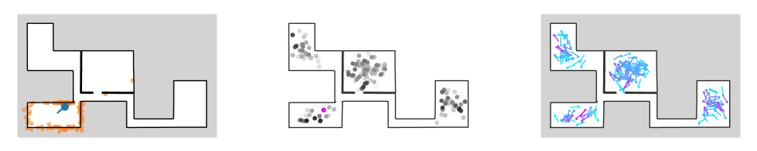
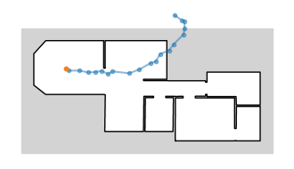
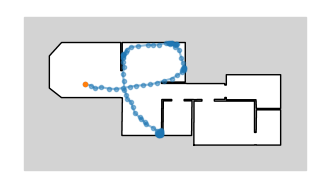
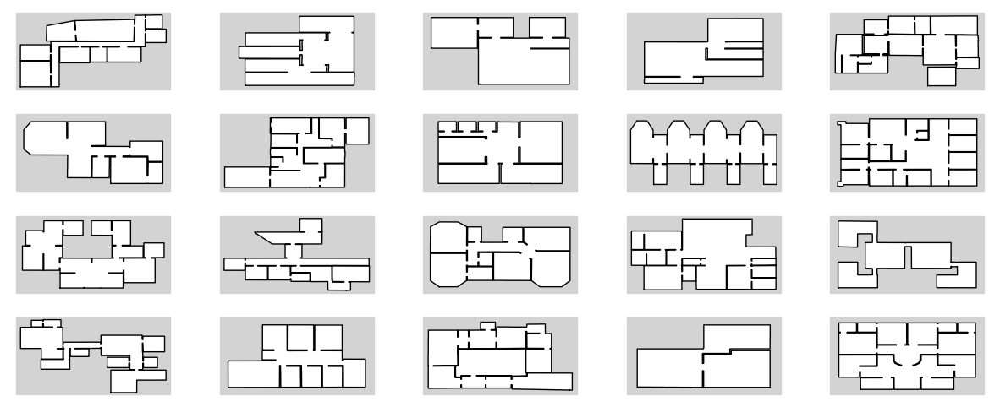

# SLAM Tutorial in Gen

First steps towards a [SLAM](https://en.wikipedia.org/wiki/Simultaneous_localization_and_mapping) tutorial in Gen. [Gen](https://www.gen.dev/)  is a general-purpose probabilistic programming system, embedded in Julia. I use environments from the [HouseExpo](https://github.com/TeaganLi/HouseExpo) dataset, wich can be found on github. The data set is accompanied by the arXiv preprint:

> Li et al., "HouseExpo: A Large-scale 2D Indoor Layout Dataset for 
> Learning-based Algorithms on Mobile Robots", arXiv (2019).

**Overview.**

Note: This is an incomplete first draft and everything is under heavy construction.
The notebooks don't always render right on Github; the links point to the notebooks in Jupyter's "nbviewer":

- [1_Sensor_model_with_pose_prior.ipynb](https://nbviewer.jupyter.org/github/mirkoklukas/prob-slam-in-gen/blob/master/1_Sensor_model_with_pose_prior.ipynb.ipynb)
	- Simple Lidar sensor model 
	- Naive pose inference
	
- [2_Controller_and_transition_model.ipynb](https://nbviewer.jupyter.org/github/mirkoklukas/prob-slam-in-gen/blob/master/2_Controller_and_transition_model.ipynb)
	- Simple motion model:
	- Ghost motion model
	- Actual motion model
	- ...

- [3_Map_playground.ipynb](https://nbviewer.jupyter.org/github/mirkoklukas/prob-slam-in-gen/blob/master/3_Map_playground.ipynb)

**Some plots from the notebooks.**

**Fig 1: Basic Lidar model.** 
Left: Pose of the agent and its measurements. 
Right: The depth measurements as a function of angles. 
(The head direction corresponds to the center of the plot.)

**Fig 2: Naive localization with known map and no motion.**
Left: True pose of the agent and its measurements. Middle: Naive MC inference. Gray values indicate probabilies of the respective poses, and the pink marker is placed at the mode of the posterior `p(x | z)`. Right: Same as in middle but we are actually showing the orientation of the agent not only its position; colormap varies from blue (low) to warm (high).

**Fig 3: Motion model.** 
Naive agent motion model that can walk through walls.

**Fig 4: Better Motion model.** 
Agent motion model that is somewhat aware of boundaries.

**Fig 5: Environments.** 
Excerpts from the *HouseExpo* dataset