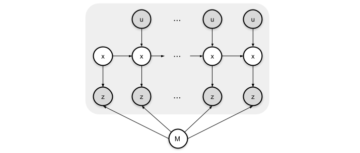
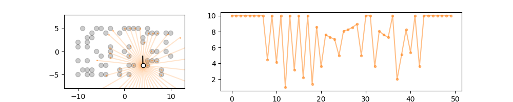
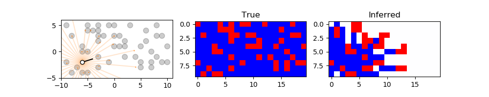
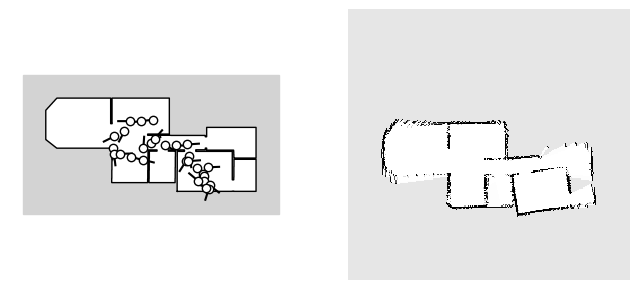
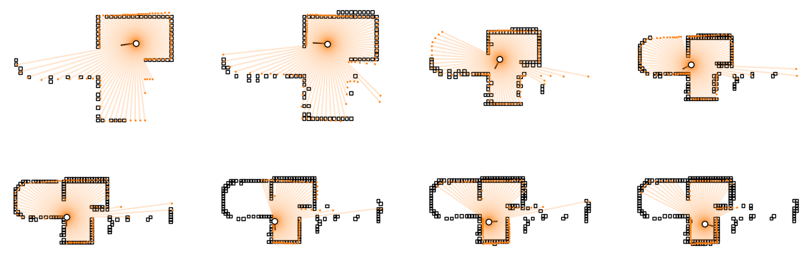
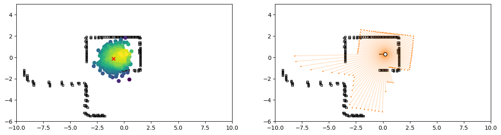
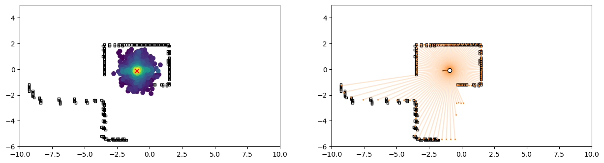

# SLAM Tutorial in Gen

First steps towards a [SLAM](https://en.wikipedia.org/wiki/Simultaneous_localization_and_mapping) tutorial in Gen. [Gen](https://www.gen.dev/)  is a general-purpose probabilistic programming system, embedded in Julia. I use environments from the [HouseExpo](https://github.com/TeaganLi/HouseExpo) dataset, wich can be found on github. The data set is accompanied by the arXiv preprint:

> Li et al., "HouseExpo: A Large-scale 2D Indoor Layout Dataset for 
> Learning-based Algorithms on Mobile Robots", arXiv (2019).

**Overview.**

Note: This is an incomplete first draft and everything is under heavy construction.
The notebooks don't always render right on Github; the links point to the notebooks in Jupyter's "nbviewer":

- [Part 1 - Occupancy map with sensor model](https://nbviewer.jupyter.org/github/mirkoklukas/prob-slam-in-gen/blob/master/01_SLAM_Tutorial_Part_1.ipynb)
	- ...

- [Part 2 - Motion model and SLAM model](https://nbviewer.jupyter.org/github/mirkoklukas/prob-slam-in-gen/blob/master/02_SLAM_Tutorial_Part_2.ipynb)
	- ...

**Visual summary.**

- **Fig: SLAM Graphical model.**

**Fig: Sensor model.** We implement a simple simulated Lidar sensor on occupancy maps and its inverse model.

- **Fig: Inferred map.** Left: Actual poses of an agent in a simulated environment. Right: Inferred occupancy map from "classical" online SLAM approach. 

- **Fig: Map updates.** Inferred position and how sensor measurements at time $t$ fit the map at $t-1$.

- **Fig: Sensor drop out.** Sensor with no drop out in top row vs 20% dropout in bottom row.
